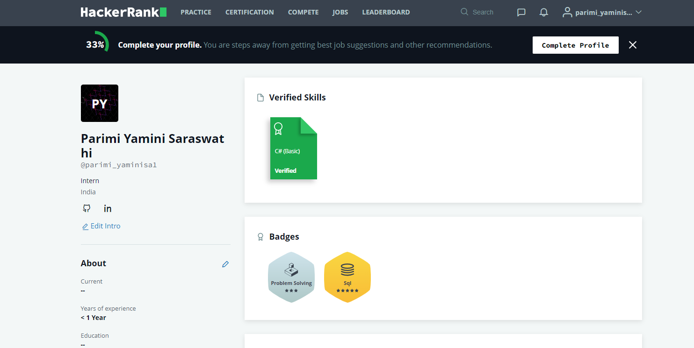
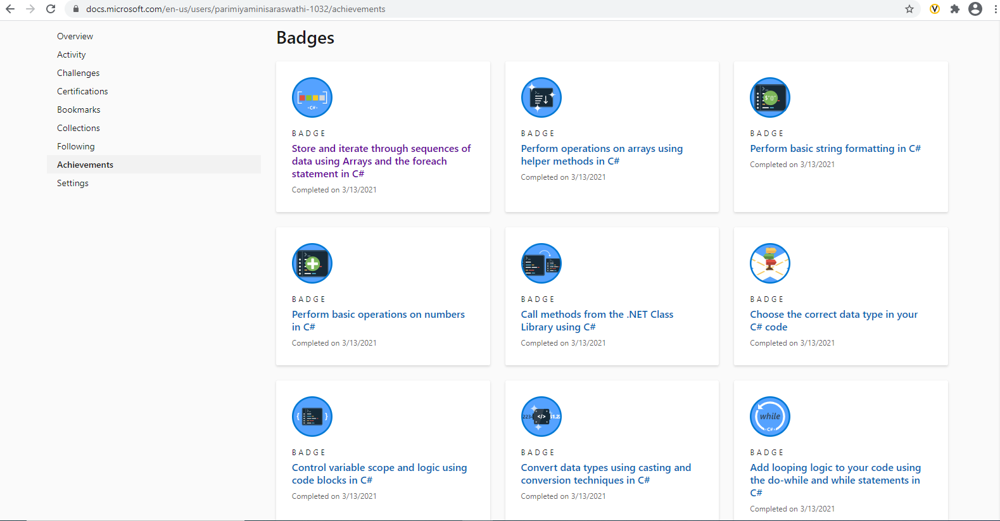
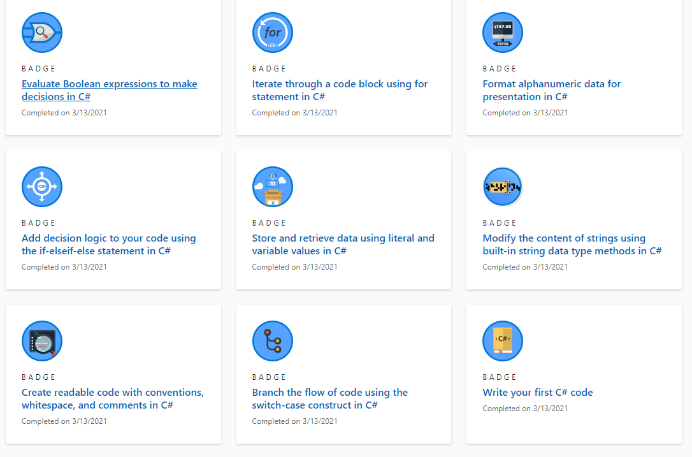
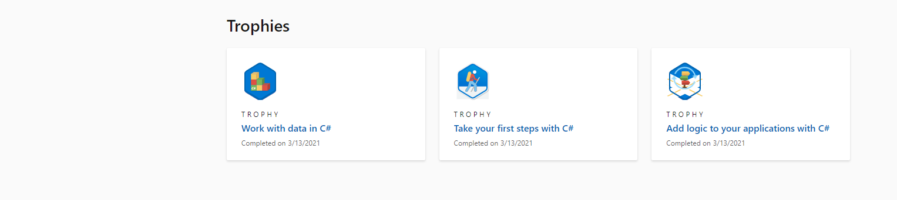
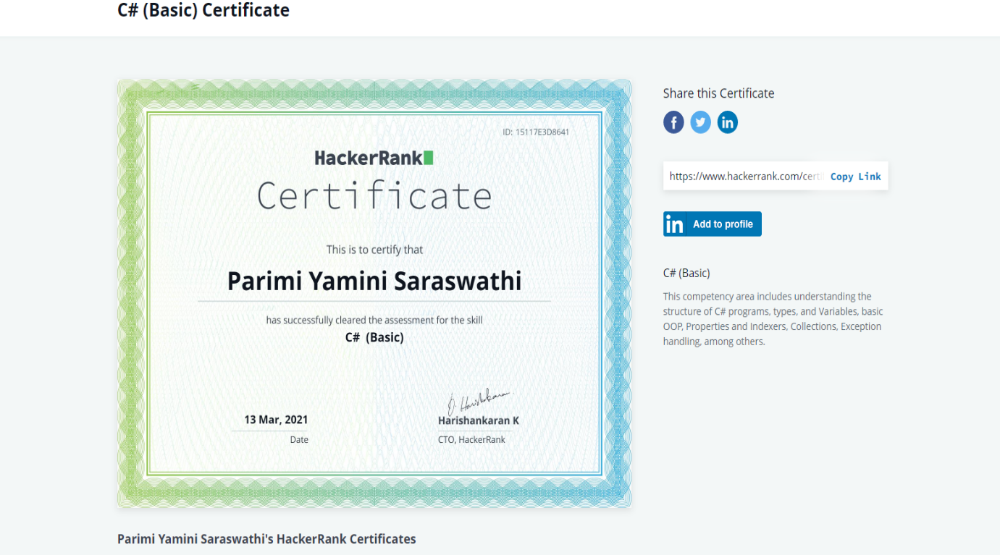

**Name** : Parimi Yamini Saraswathi

**Contact Details** : 7995467895

**E-Mail** : parimi.yaminisaraswathi@ltts.com

**Programming Skills** : C#

**Framework** : .NET Framework, ADO.NET, Entity Framework,ASP.NET MVC, ASP.NET Web API

**Tools** : SQL Server Management Studio, SQL, Visual Studio 2019,Postman,LINQPad

**Platforms** : Azure DevOps, GitHub

**Badges** :

HackerRank:

Microsoft Badges :

**Certificates**: 

HackerRank C# Certification : 

**Mini** **Projects** : 

Embedded Lab Management: <https://dev.azure.com/parimiyaminisaraswathi/99003663_Emb_Lab_Mgmt>

Demo Cart Application:

<https://dev.azure.com/parimiyaminisaraswathi/99003663_DemoKart_App>

